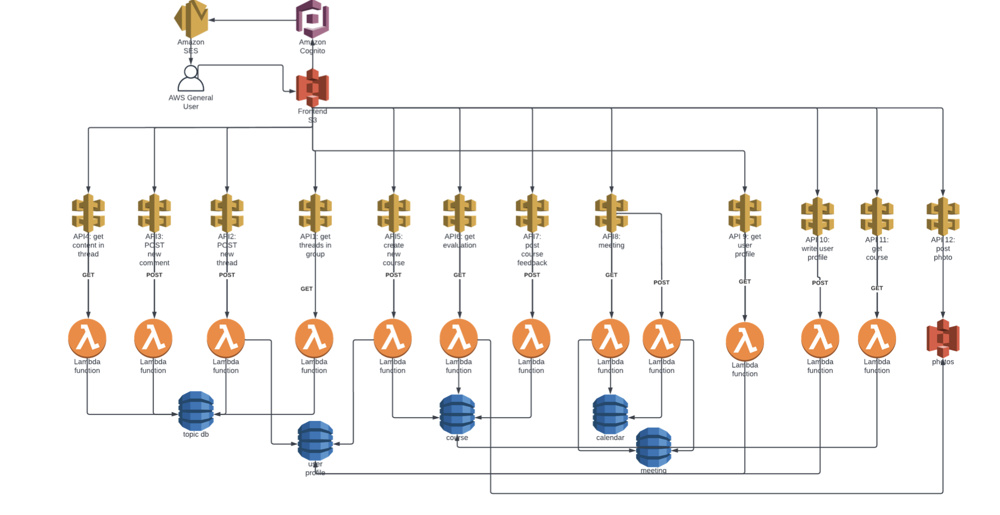

#  CU LION NET
CU Lion Net system is built using vue as front end, python and lambda function as back end and DynamoDB as database. At the same time, API Gateway is used as a middle ware. Three main functions are implemented: Course evaluation, Discussion on specific topics and Time scheduler. Also, we add another part called ”User Profile” where user can upload their head portrait and their basic information.

# System Diagram
</img>

# Video Demo